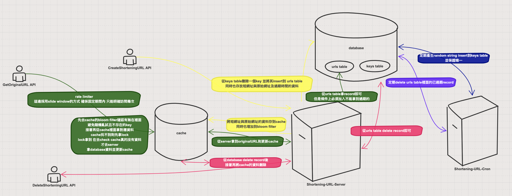

# Shortening-URL

## 前言
實現縮網址的功能，其實認真設計發現水滿深的，很多細節要注意到。

可以看到branch有version1 ~ version7
之後想寫blog或是拍影片來說明每個版本的更迭遇到了什麼問題怎樣去分析及解決。

裡面其實有用到我的一些之前封裝好的module，例如：golib, gin-starter。可以去看看～～


## 設計思路

### 產生短網址的方式

#### Hash function VS Random string

* Hash function

  透過Hash function產生唯一的value 再將這個value透過base64進行encode再根據短網址的長度需求只取前面幾個字元之類的

  優點：

  * Hash function可以保證會產生唯一value

  缺點：

  * Hash function遇到相同的input會產生相同的value 也就是說如果許多使用者用相同的網址的話會產生相同的縮網址 這是不可接受的 所以必須再加上唯一的value搭配網址當作input丟進hash function

    唯一的value怎麼來？

    * 使用者的id 或是根據database存的serial number來確保每個使用者丟相同的網址不會得到相同的短網址
    * 麻煩的點在於說：使用者id如果存在database的話 必須先去拿對應user的id出來之後再做hash的計算 或者是撈database的縮網址與原始網址對應的table的record數目 來當作serial number 但是要額外注意撈取的過程中是不是會有其他request同時insert record的問題 如果沒注意到 可能導致兩個使用者拿到相同的serial number 這樣產生出來的縮網址會一致的。

  * Hash function搭配base64 encode的話 如果只取前面幾位數可能會有容易重複的風險

  * Hash function會有一定的performance的overhead 可能導致在concurrent產生縮網址的時候會較慢

* Random string

  單純以英文字母或是英文字母+數字來產生random string

  優點：

  * 在一定程度上仍然可以保持產生不會重複random string 如果重複了則代表該操作失敗 reject user 或是 retry 

    但是仍然有方式可以避免 如果事先產生好不會重複的一堆random string 供使用者隨機選取一個random string那麼在使用上不需要特別考慮重複的問題

  * 產生random string的速度高於hash function 甚至可以預先產生好一堆random string 那麼可以大幅降低overhead 因為使用者拿到縮網址的操作 僅僅是去資料庫拿一筆record即可 而不需要做產生縮網址的操作
  * 產生random string不需要拿使用者的id或是搭配serial number 

  缺點：

  * 有風險會產生重複的random string 如果有限制產生random string的長度數量會是固定的

    這個缺點我覺得看系統的設計 假設系統的使用者的用戶量本來就不會超過 random string total數目 那麼根本無所謂 而且縮網址是會過期的 也就是說過期的random string是可以拿回來重複利用的。

    當超過一定數量的話 可以考慮增長random string的長度

    以英文字母大小寫加數字並規定長度為6 就有 62 * 62 * 62 * 62 * 62 * 62 的數量 其實很夠用

    而重複的缺點 可以事先產生好一堆沒有重複的random string來解決問題

#### 結論

本實作中採用了random string的方式 並且採用的方式是上線前產生一定數量的random string 並且透過cron job的方式每隔一段時間產生random string

所以可以消除重複及產生縮網址過多的performance overhead

### cache的設計方式

cache的設計往往遇到以下三種問題：

* cache penetration
* cache breakdown
* cache avalanche

以本系統來說最會遇到這些問題的就是用縮網址來redirect到原始網址的這隻API 因為原始網址會需要去cache拿 那麼會遇到cache miss 需要更新的情況 以及遇到大量random亂試不存在該縮網址的請求

而根據以上三個問題在本系統使用的解法如下：

本系統解決方式如下：

* 以先在cache前面放一個rate-limiter來限制一段期間內只能有固定的request進來 當然這個方式是不管有沒有cache penetration都一定要有的 但是至少可以讓每一個人只能有固定的request數量進來
* 先在server做參數驗證 以本系統為例只能允許6個字元的random string的縮網址 所以可以先reject非六個字元的random string的請求
* 當到cache的時候 先用Cuckoo Filter(bloom filter的變形 可以支援刪除元素操作) 來檢查請求過來的random string有沒有在filter裏面 也就是說每一個產生新的縮網址的操作就應該要先把對應的random string加入到這個filter 那麼在後續請求該縮網址的時候透過這個filter就可以檢查有沒有在裡面 如果不存在代表這個random string是無效的 理論上也不存在於database 因此可以直接reject
* 而如果在filter則先去cache拿對應的資料 如果沒有則需要取得lock 這個lock可以確保同時間只能有一個request進去拿database的資料並且更新cache 才會release lock 而取得lock後要進行第二次的cache 檢查 看會不會有cache hit 因為有可能已經其他request已經先拿了lock並更新cache 這樣可以避免同時有大量的request要進去database並更新cache
* 此外每一個originalURL cache data都會將TTL加上隨機的時間 這樣是避免同時有大量的cache data在同一時刻失效的問題 盡可能地降低cache與database的負擔

## 系統架構

以下架構主要是base on single server的設計

muti server可能會有更好的設計



### 系統元件

* Shortening-URL-Server

  為web api server

* Shorteing-URL-Cron

  有兩個cronjob

  1. 定期產生random key 到 database
  2. 定期delete expired url

* cache

  負責rate-limit 以及 originalURL相關cache data

### database schema

```sql
CREATE TABLE IF NOT EXISTS urls(
    id CHARACTER VARYING(6) PRIMARY KEY NOT NULL, -- 縮網址的random string
    original CHARACTER VARYING(2048) NOT NULL, -- 原始網址
    created_at TIMESTAMP WITHOUT TIME ZONE NOT NULL DEFAULT current_timestamp,
    expired_at TIMESTAMP WITHOUT TIME ZONE NOT NULL DEFAULT current_timestamp
);
```

```sql
CREATE TABLE IF NOT EXISTS keys(
    id CHARACTER VARYING(6) PRIMARY KEY NOT NULL, -- 縮網址的random string
    created_at TIMESTAMP WITHOUT TIME ZONE NOT NULL DEFAULT current_timestamp
);
```

## 如何使用該專案

不管是測試或是code gen及編譯或是local運行都是透過docker的方式來輔助

### 測試

```bash
./dockerbuild.sh test
```

### codegen

```bash
./dockerbuild.sh codegen
```

### build

```bash
./dockerbuild.sh
```

### local 運行

有一些環境變數可以先看一下：

* POSTGRES_MIGRATION_FILE_DIR

  這個代表的是PostgreSQL的migration SQL file

* POSTGRES_URL

* REDIS_URL

* SLIDE_WINDOW_RATE_LIMITER_CAPACITY

  這個代表的是允許一段時間內可以訪問幾次 預設100

* SLIDE_WINDOW_RATE_LIMITER_INTERNAL

  這個代表的是多長的間距 預設1h

運行：

```bash
docker-compose up server
docker-compose up cron
```

#### API介紹

* CreateShorteningURL 建立縮網址

  * example request

    ```bash
    curl -X POST -H "Content-Type: application/json" \
        -d '{"url": "https://blog.kennycoder.io"}' \
        localhost:8080/api/v1/urls
    ```

  * example response

    ```json
    {"id":"KAWCny","shortUrl":"localhost:8080/KAWCny"}
    ```

* GetOriginalURL 縮網址 redirect to 原始網址

  * example request

    ```bash
    curl -X GET localhost:8080/KAWCny
    ```

  * example response

    ```html
    <a href="https://blog.kennycoder.io">Temporary Redirect</a>.
    ```

* DeleteShorteningURL 刪除縮網址

  * example request

    ```bash
    curl -X DELETE localhost:8080/api/v1/urls/KAWCny
    ```

### 注意

* 因為keys table裡面的random string是透過cronjob定時產生的 所以如果上線前需要準備好一定數量的random string insert to keys table

* 為了方便local測試 有提供的一個 `/api/v1/_internal/keys` route 來insert random string to keys table

  * example request

    ```bash
    curl -X POST -H "Content-Type: application/json" \
        -d '{"number": 10}' \
        localhost:8080/api/v1/_internal/keys
    ```

    number 代表要產生random string的數量

  * example response

    ```json
    {"length":10}
    ```

    length代表成功產生random string的數量

## todo

* 寫api document
* more unit test
* 考量到multi server的設計
* 也許delete expired url有更好的方式
* 加入CI/CD
* 加入kubernetest deploy yaml
* 加入local cache 
* 將random string 加入 checksum 可以更有效地檢查出違法亂try的request 也許就不需要用bloom filter
* bloom filter如果命中率下降 則可以加開新的bloom filter
* 增加redis 的qps 可以透過shard的方式來存放
* local cache先拿一些key 這樣create 縮網址可以更快速 只有當local cache的key沒有的話再去跟PG拿
* 利用singleFlight 來實現lock 機制可能會更省事

## contribution

* 發Issue or PR 給我更好設計的靈感或是討論

## 
* checksum + randomID